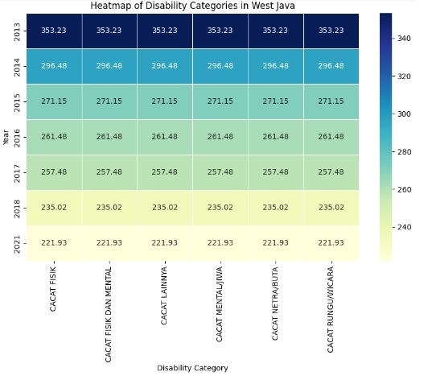
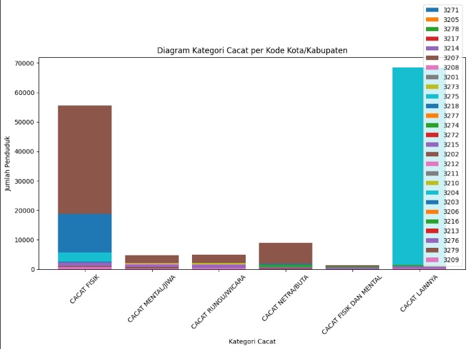
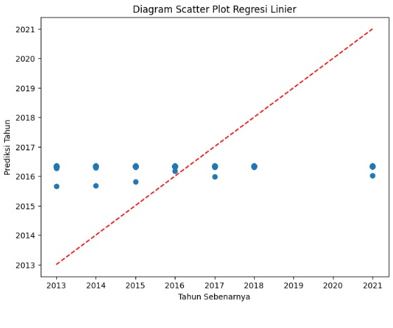
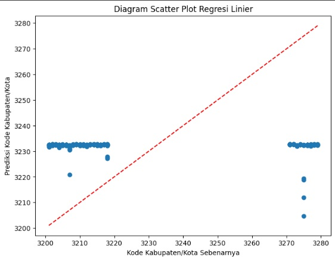

# project-big-data-2023
  

  Dalam langkah ini, kita membaca data dari file CSV.Kemudian, kita melakukan pembersihan data dengan menghapus baris duplikat dan baris dengan nilai null.
Lalu membuat kolom baru dengan nama "tahun" yang memiliki tipe data Integer. Selanjutnya mengelompokkan data berdasarkan kolom "kode_provinsi" dan "tahun". Kemudian, kita menggunakan fungsi agg() dan avg() untuk menghitung rata-rata dari kolom "jumlah_penduduk". Alias "avg_jumlah_penduduk" digunakan untuk memberi nama kolom hasil perhitungan. Lalu kita menggunakan metode join() untuk bergabung antara DataFrame awal (df) dengan DataFrame hasil perhitungan rata-rata (avg_jumlah_penduduk_df). Kedua DataFrame digabungkan berdasarkan kolom "kode_provinsi" dan "tahun".

  <pre>
    <code>
from pyspark.sql import SparkSession
from pyspark.sql.functions import avg
from pyspark.sql.types import IntegerType

# Inisialisasi SparkSession
spark = SparkSession.builder.getOrCreate()

# Membaca data dari file CSV
df = spark.read.csv("/content/drive/MyDrive/Big-Data/big-data.csv", header=True, inferSchema=True)
df = df.dropDuplicates().na.drop()

# Mengubah tipe data kolom tahun menjadi Integer
df = df.withColumn("tahun", df["tahun"].cast(IntegerType()))

# Menghitung rata-rata jumlah_penduduk berdasarkan kode_provinsi dan tahun
avg_jumlah_penduduk_df = df.groupBy("kode_provinsi", "tahun").agg(avg("jumlah_penduduk").alias("avg_jumlah_penduduk"))

# Bergabung dengan DataFrame awal untuk mendapatkan kolom avg_jumlah_penduduk
df_with_avg_jumlah_penduduk = df.join(avg_jumlah_penduduk_df, ["kode_provinsi", "tahun"])

# Menampilkan hasil
df_with_avg_jumlah_penduduk.show()
    </code>
  </pre>

## Machine Learning Flowchart

  pengolahan data dengan cara mengurutkan data berdasarkan tahun secara ascending lalu pivot tabel dengan menggunakan fungsi agregasi mean untuk menggabungkan nilai-nilai yang memiliki tahun yang sama dan hasilnya akan ditampilkan berupa diagram heatmap.

  <pre>
    <code>
import seaborn as sns
import matplotlib.pyplot as plt

# Mengambil data Jawa Barat dari DataFrame
jawa_barat_df = df_with_avg_jumlah_penduduk.filter(df_with_avg_jumlah_penduduk["kode_provinsi"] == "32")

# Mengurutkan data berdasarkan tahun secara ascending
jawa_barat_df = jawa_barat_df.orderBy("tahun")

# Mengubah DataFrame menjadi Pandas DataFrame
jawa_barat_pd = jawa_barat_df.toPandas()

# Pivot tabel dengan menggunakan fungsi agregasi mean untuk menggabungkan nilai-nilai yang memiliki tahun yang sama
jawa_barat_pivot = jawa_barat_pd.pivot_table(index="tahun", columns="kategori_disabilitas", values="avg_jumlah_penduduk", aggfunc="mean")

# Membuat heatmap menggunakan seaborn
plt.figure(figsize=(10, 6))
sns.heatmap(jawa_barat_pivot, cmap="YlGnBu", annot=True, fmt=".2f", linewidths=0.5, cbar=True)
plt.xlabel("Disability Category")
plt.ylabel("Year")
plt.title("Heatmap of Disability Categories in West Java")
plt.show()
    </code>
  </pre>

## diagram heatmap

  langkah selajutnya.

  <pre>
    <code>
from pyspark.sql import SparkSession
from pyspark.sql.functions import sum

# Inisialisasi SparkSession
spark = SparkSession.builder.getOrCreate()

# Membaca data dari file CSV
df = spark.read.csv("/content/drive/MyDrive/Big-Data/big-data.csv", header=True, inferSchema=True)
df = df.dropDuplicates().na.drop()

# Menghitung rata-rata jumlah_penduduk berdasarkan kode_provinsi dan tahun
avg_jumlah_penduduk_df = df.groupBy("kode_provinsi", "tahun").agg(avg("jumlah_penduduk").alias("avg_jumlah_penduduk"))

# Bergabung dengan DataFrame awal untuk mendapatkan kolom avg_jumlah_penduduk
df_with_avg_jumlah_penduduk = df.join(avg_jumlah_penduduk_df, ["kode_provinsi", "tahun"])

# Menghitung jumlah penduduk berdasarkan kategori kecacatan
jumlah_penduduk_kecacatan = df_with_avg_jumlah_penduduk.groupBy("kategori_disabilitas").agg(sum("avg_jumlah_penduduk").alias("total_jumlah_penduduk"))

# Mengurutkan hasil secara descending (terbesar hingga terkecil)
jumlah_penduduk_kecacatan = jumlah_penduduk_kecacatan.orderBy("total_jumlah_penduduk", ascending=False)

# Menampilkan hasil
jumlah_penduduk_kecacatan.show()
    </code>
  </pre>

  Selanjutnya adalah mengkategorikan setiap jenis cacat dan jumlahnya sesuai dengan kode kabupaten/kota. Pada diagram ini nantinya dapat diketahui jumlah cacat dari setiap kota/kabupaten berdasarkan jenis cacatnya..

  <pre>
    <code>
import matplotlib.pyplot as plt
import pandas as pd
from pyspark.sql import SparkSession
from pyspark.sql.functions import sum

# Inisialisasi SparkSession
spark = SparkSession.builder.getOrCreate()

# Membaca data dari file CSV
df = spark.read.csv("/content/drive/MyDrive/Big-Data/big-data.csv", header=True, inferSchema=True)
df = df.dropDuplicates().na.drop()

# Menghitung jumlah penduduk berdasarkan kode_kabupaten_kota dan kategori_disabilitas
jumlah_penduduk_kota_kabupaten = df.groupBy("kode_kabupaten_kota", "kategori_disabilitas").agg(sum("jumlah_penduduk").alias("total_jumlah_penduduk"))

# Mengumpulkan data dalam format Pandas DataFrame
data_pd = jumlah_penduduk_kota_kabupaten.toPandas()

# Menampilkan diagram kategori cacat untuk setiap kode kota/kabupaten
fig, ax = plt.subplots(figsize=(12, 6))

# Loop melalui setiap kode kota/kabupaten
for kode in data_pd["kode_kabupaten_kota"].unique():
    data_kota_kabupaten = data_pd[data_pd["kode_kabupaten_kota"] == kode]
    ax.bar(data_kota_kabupaten["kategori_disabilitas"], data_kota_kabupaten["total_jumlah_penduduk"], label=kode)

ax.set_xlabel("Kategori Cacat")
ax.set_ylabel("Jumlah Penduduk")
ax.set_title("Diagram Kategori Cacat per Kode Kota/Kabupaten")
ax.legend()
plt.xticks(rotation=45)
plt.show()
    </code>
  </pre>

## Hasil Akhir

#Linear Agression

  <pre>
    <code>
import matplotlib.pyplot as plt
import pandas as pd
from pyspark.sql import SparkSession
from pyspark.ml.feature import VectorAssembler
from pyspark.ml.regression import LinearRegression
from pyspark.ml.evaluation import RegressionEvaluator
from pyspark.sql.functions import col

# Inisialisasi SparkSession
spark = SparkSession.builder.getOrCreate()

# Membaca data dari file CSV
df = spark.read.csv("/content/drive/MyDrive/Analisis_Kecacatan/big-data.csv", header=True, inferSchema=True)
df = df.dropDuplicates().na.drop()

# Menghapus baris dengan nilai kosong atau tidak terdefinisi pada kolom 'tahun'
df = df.filter(col("tahun").isNotNull())

# Memilih fitur yang akan digunakan dalam model
feature_columns = ['jumlah_penduduk']
assembler = VectorAssembler(inputCols=feature_columns, outputCol="features")
data = assembler.transform(df)

# Membagi data menjadi training set dan testing set
(trainingData, testData) = data.randomSplit([0.7, 0.3])

# Memeriksa apakah training dataset tidak kosong
if trainingData.count() == 0:
    raise ValueError("Training dataset is empty. Adjust the split ratio or check the data.")

# Membuat objek regresi linier
lr = LinearRegression(featuresCol="features", labelCol="tahun")

# Melatih model menggunakan training set
model = lr.fit(trainingData)

# Melakukan prediksi terhadap testing set
predictions = model.transform(testData)

# Mengumpulkan hasil prediksi dalam format Pandas DataFrame
predictions_pd = predictions.select("prediction", "tahun").toPandas()

# Membuat diagram scatter plot untuk membandingkan prediksi dengan nilai sebenarnya
fig, ax = plt.subplots(figsize=(8, 6))
ax.scatter(predictions_pd["tahun"], predictions_pd["prediction"])
ax.plot([predictions_pd["tahun"].min(), predictions_pd["tahun"].max()],
        [predictions_pd["tahun"].min(), predictions_pd["tahun"].max()], 'r--')
ax.set_xlabel("Tahun Sebenarnya")
ax.set_ylabel("Prediksi Tahun")
ax.set_title("Diagram Scatter Plot Regresi Linier")
plt.show()
    </code>
  </pre>

  <pre>
    <code>
import matplotlib.pyplot as plt
import pandas as pd
from pyspark.sql import SparkSession
from pyspark.ml.feature import VectorAssembler
from pyspark.ml.regression import LinearRegression
from pyspark.ml.evaluation import RegressionEvaluator
from pyspark.sql.functions import col

# Inisialisasi SparkSession
spark = SparkSession.builder.getOrCreate()

# Membaca data dari file CSV
df = spark.read.csv("/content/drive/MyDrive/Analisis_Kecacatan/big-data.csv", header=True, inferSchema=True)
df = df.dropDuplicates().na.drop()

# Menghapus baris dengan nilai kosong atau tidak terdefinisi pada kolom 'kode_kabupaten_kota'
df = df.filter(col("kode_kabupaten_kota").isNotNull())

# Memilih fitur yang akan digunakan dalam model
feature_columns = ['jumlah_penduduk']
assembler = VectorAssembler(inputCols=feature_columns, outputCol="features")
data = assembler.transform(df)

# Membagi data menjadi training set dan testing set
(trainingData, testData) = data.randomSplit([0.7, 0.3])

# Memeriksa apakah training dataset tidak kosong
if trainingData.count() == 0:
    raise ValueError("Training dataset is empty. Adjust the split ratio or check the data.")

# Membuat objek regresi linier
lr = LinearRegression(featuresCol="features", labelCol="kode_kabupaten_kota")

# Melatih model menggunakan training set
model = lr.fit(trainingData)

# Melakukan prediksi terhadap testing set
predictions = model.transform(testData)

# Mengumpulkan hasil prediksi dalam format Pandas DataFrame
predictions_pd = predictions.select("prediction", "kode_kabupaten_kota").toPandas()

# Membuat diagram scatter plot untuk membandingkan prediksi dengan nilai sebenarnya
fig, ax = plt.subplots(figsize=(8, 6))
ax.scatter(predictions_pd["kode_kabupaten_kota"], predictions_pd["prediction"])
ax.plot([predictions_pd["kode_kabupaten_kota"].min(), predictions_pd["kode_kabupaten_kota"].max()],
        [predictions_pd["kode_kabupaten_kota"].min(), predictions_pd["kode_kabupaten_kota"].max()], 'r--')
ax.set_xlabel("Kode Kabupaten/Kota Sebenarnya")
ax.set_ylabel("Prediksi Kode Kabupaten/Kota")
ax.set_title("Diagram Scatter Plot Regresi Linier")
plt.show()
    </code>
  </pre>

