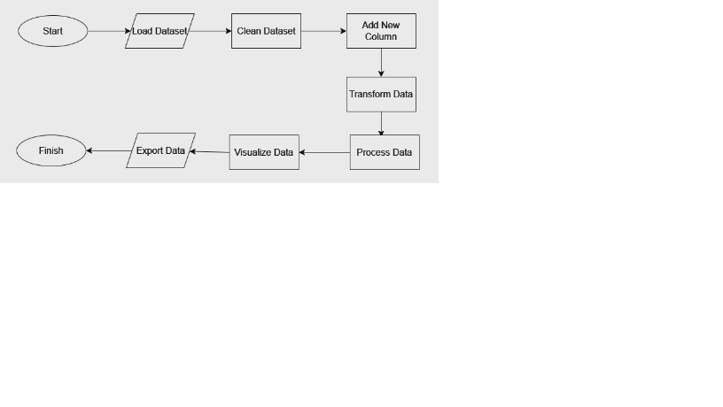

# project-big-data-2023
# Scenario 1 Bar Graph
  

  Dalam langkah ini, kita membaca data dari file CSV.Kemudian, kita melakukan pembersihan data dengan menghapus baris duplikat dan baris dengan nilai null.
Lalu membuat kolom baru dengan nama "tahun" yang memiliki tipe data Integer. Selanjutnya mengelompokkan data berdasarkan kolom "kode_provinsi" dan "tahun". Kemudian, kita menggunakan fungsi agg() dan avg() untuk menghitung rata-rata dari kolom "jumlah_penduduk". Alias "avg_jumlah_penduduk" digunakan untuk memberi nama kolom hasil perhitungan. Lalu kita menggunakan metode join() untuk bergabung antara DataFrame awal (df) dengan DataFrame hasil perhitungan rata-rata (avg_jumlah_penduduk_df). Kedua DataFrame digabungkan berdasarkan kolom "kode_provinsi" dan "tahun".

  <pre>
    <code>
from pyspark.sql import SparkSession
from pyspark.sql.functions import avg
from pyspark.sql.types import IntegerType

# Inisialisasi SparkSession
spark = SparkSession.builder.getOrCreate()

# Membaca data dari file CSV
df = spark.read.csv("/content/drive/MyDrive/Big-Data/big-data.csv", header=True, inferSchema=True)
df = df.dropDuplicates().na.drop()

# Mengubah tipe data kolom tahun menjadi Integer
df = df.withColumn("tahun", df["tahun"].cast(IntegerType()))

# Menghitung rata-rata jumlah_penduduk berdasarkan kode_provinsi dan tahun
avg_jumlah_penduduk_df = df.groupBy("kode_provinsi", "tahun").agg(avg("jumlah_penduduk").alias("avg_jumlah_penduduk"))

# Bergabung dengan DataFrame awal untuk mendapatkan kolom avg_jumlah_penduduk
df_with_avg_jumlah_penduduk = df.join(avg_jumlah_penduduk_df, ["kode_provinsi", "tahun"])

# Menampilkan hasil
df_with_avg_jumlah_penduduk.show()
    </code>
  </pre>

## Machine Learning Flowchart

